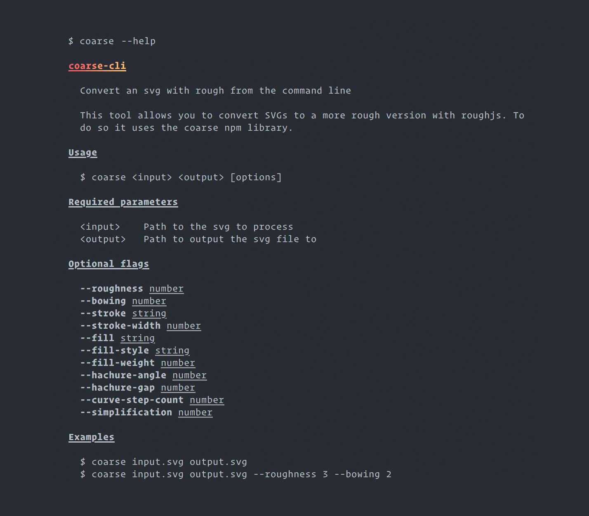

# coarse-cli

[![build status][build-badge]][build-url]

> convert an svg with rough from the command line

This tool allows you to convert SVGs to a more rough version with [rough](https://github.com/pshihn/rough). To do so it uses [coarse](https://github.com/ismay/coarse).

## Installation

```bash
npm install -g coarse-cli
```

## Usage



## License

[MIT](http://ismay.mit-license.org/)

[build-badge]: https://travis-ci.org/ismay/coarse-cli.svg?branch=master
[build-url]: https://travis-ci.org/ismay/coarse-cli
